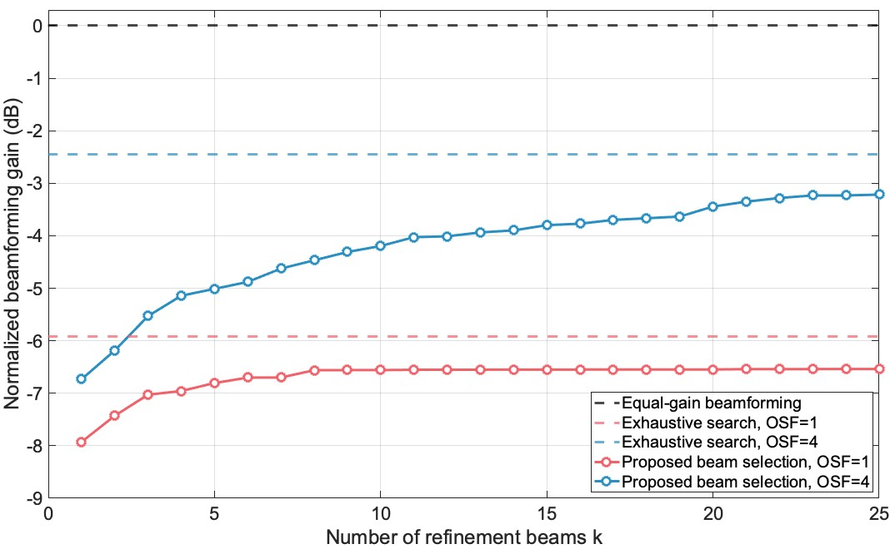

# Integrated Imaging and Communication with Reconfigurable Intelligent Surfaces
This is a code package related to the following article: "[Integrated Imaging and Communication with Reconfigurable Intelligent Surfaces](https://ieeexplore.ieee.org/abstract/document/10476888)", accepted to the 57th Asilomar Conference on Signals, Systems, and Computers, 2023.

# Abstract of the Article
Reconfigurable intelligent surfaces, with their large number of antennas, offer an interesting opportunity for high spatial-resolution imaging. In this paper, we propose a novel RIS-aided integrated imaging and communication system that can reduce the RIS beam training overhead for communication by leveraging the imaging of the surrounding environment. In particular, using the RIS as a wireless imaging device, our system constructs the scene depth map of the environment, including the mobile user. Then, we develop a user detection algorithm that subtracts the background and extracts the mobile user attributes from the depth map. These attributes are then utilized to design the RIS interaction vector and the beam selection strategy with low overhead. Simulation results show that the proposed approach can achieve comparable beamforming gain to the optimal/exhaustive beam selection solution while requiring 1000 times less beam training overhead.

# Code Package Content

**Data**
- The data used in this package can be found in this [Dropbox folder](https://www.dropbox.com/scl/fo/vwmn39s98iyi20ghnep4u/AB_cAXIXQ3WWO6jlHfSkNs0?rlkey=16ji2helunfkn4payxyucb3gy&dl=0). Please download these files to this repository.
- The Blender and Wireless Insite files of the samples can be found in this [Dropbox folder](https://www.dropbox.com/scl/fo/vzhmko7020cm0bawnwzga/AK9zmT8cKAfY3ivIuR68ESg?rlkey=mwpbiv47gq7h1pjnppzpciusk&dl=0).

**Background subtraction of scene depth map**
- Run the following script to perform background subtraction.
  ```
  python subtract_background.py \
    -b range_maps/background/RIS40x40_OSF4x4_RDMest.mat \
    -r range_maps/sample1/RIS40x40_OSF4x4_RDMest.mat
  ```
- Run `run.sh` to apply background subtraction to all scenes.
- Run `plot_depth_maps.m` to visualize the depth maps. 

**Imaging-aided RIS beam searching**
- Run `generate_sorted_UPA_codebook.m` to generate (oversampled) communication codebook.
- Run `comm_simulation.m` to generate the results.

**Beamforming gain of top-k beams**
- Run `plot_topk_vs_bf_gain.m` to generate the figure.


# License and Referencing
<a rel="license" href="http://creativecommons.org/licenses/by-nc-sa/4.0/"></a><br />This code package is licensed under a [Creative Commons Attribution-NonCommercial-ShareAlike 4.0 International License](https://creativecommons.org/licenses/by-nc-sa/4.0/).

If you in any way use this code for research that results in publications, please cite our original article:

> H. Luo and A. Alkhateeb, "Integrated Imaging and Communication with Reconfigurable Intelligent Surfaces," 2023 57th Asilomar Conference on Signals, Systems, and Computers, Pacific Grove, CA, USA, 2023, pp. 151-156.
